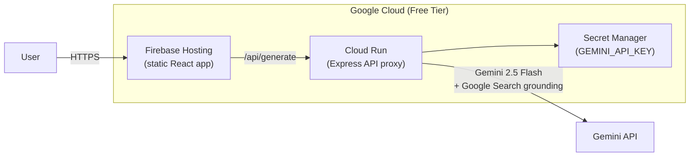

# Ship The Node Newsletter on Google Cloud

## Current State (Completed)

All tasks completed. The newsletter is live at **https://the-node-newsletter.web.app** with CI/CD.

## Architecture

- **Frontend**: Vite + React on Firebase Hosting (free: 10 GB storage, 360 MB/day bandwidth)
- **Backend**: Express.js on Cloud Run (free: 2M requests/month, 360K GB-sec memory)
- **AI**: Gemini 2.5 Flash with Google Search grounding (free tier: 15 RPM, 1M TPM)
- **CI/CD**: GitHub Actions -- auto-deploy on push to `main`, preview URLs on PRs

## URLs

| Service | URL |
|---------|-----|
| Frontend | https://the-node-newsletter.web.app |
| Backend API | https://the-node-api-461466110657.us-east1.run.app |
| GitHub Repo | https://github.com/defidonllc/the-node-newsletter |
| Firebase Console | https://console.firebase.google.com/project/the-node-newsletter |
| GCP Console | https://console.cloud.google.com/home/dashboard?project=the-node-newsletter |

## Key Changes from Original Component

### 1. Replace Anthropic with Gemini (lines 209-226)

The original code called `api.anthropic.com` with Anthropic-specific tooling. This was replaced with a backend proxy at `/api/generate` that calls the `@google/generative-ai` SDK with `googleSearch` grounding tool using Gemini 2.5 Flash.

### 2. Extract Inline CSS (lines 137-173)

The `useEffect` that injected a `<style>` tag into `document.head` was moved to a proper `index.css` file. Google Fonts loaded via `<link>` in `index.html`.

### 3. Security: Sanitize `dangerouslySetInnerHTML`

All 4 instances of `dangerouslySetInnerHTML` (hook, big story, quick hits, node take) now pass through DOMPurify.

## Completed Tasks

### Phase 1: Scaffold Vite + React Project
- [x] Vite + React project with `index.html`, `App.jsx`, `main.jsx`, `package.json`
- [x] `TheNode_Newsletter.jsx` moved to `src/components/`
- [x] `App.jsx` renders `<TheNode />` wrapped in `<ErrorBoundary />`
- [x] `index.html` with `<title>`, Open Graph meta tags, SVG hexagon favicon
- [x] Styles extracted to `src/index.css`
- [x] Google Fonts loaded via `<link>` in `index.html`

### Phase 2: Backend Proxy + Gemini Integration
- [x] Express server in `backend/` with `POST /api/generate`
- [x] `@google/generative-ai` SDK calling Gemini 2.5 Flash
- [x] Google Search grounding enabled for live data
- [x] System prompt adapted for Gemini (removed Anthropic tool references)
- [x] API key stored in GCP Secret Manager, injected at runtime
- [x] CORS middleware for local dev

### Phase 3: Fix Quality-of-Life Issues
- [x] localStorage persistence for watchlist tickers
- [x] Responsive CSS media queries (768px, 480px breakpoints)
- [x] JSON parse error recovery with friendly messages + "TRY AGAIN" button
- [x] Loading skeleton with shimmer animation
- [x] SVG hexagon favicon

### Phase 4: Deploy to Google Cloud
- [x] Frontend deployed to Firebase Hosting
- [x] Backend deployed to Cloud Run (us-east1)
- [x] `GEMINI_API_KEY` in Secret Manager
- [x] `VITE_API_URL` points to Cloud Run URL in production build

### Phase 5: CI/CD
- [x] GitHub repo at `defidonllc/the-node-newsletter`
- [x] `deploy.yaml` -- push to `main` triggers backend Cloud Run deploy + frontend Firebase deploy
- [x] `ci.yaml` -- PRs get lint/build checks + Firebase preview URLs
- [x] `GCP_SA_KEY` secret set on GitHub repo (service account: `github-deploy@`)

## Free Tier Budget

| Service | Free Tier | Expected Usage |
|---------|-----------|---------------|
| Gemini 2.5 Flash | 15 RPM, 1M TPM, 1500 RPD | Well within limits for personal use |
| Cloud Run | 2M requests/mo, 360K GB-sec | Minimal -- only API proxy calls |
| Firebase Hosting | 10 GB storage, 360 MB/day | Static SPA < 5 MB |
| Secret Manager | 6 active versions, 10K access/mo | 1 secret |
